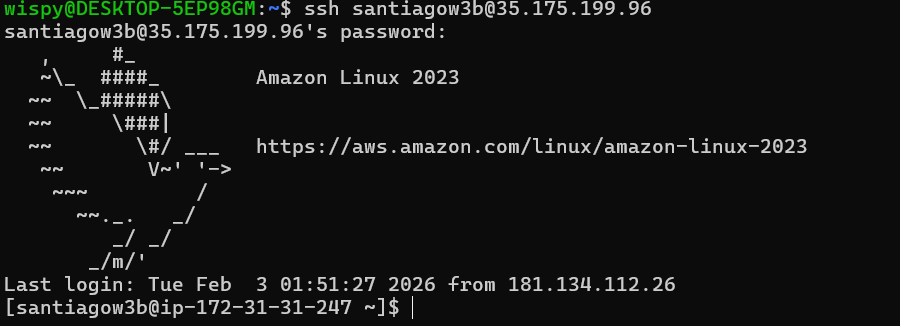
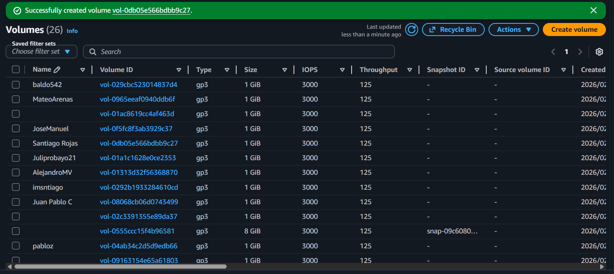
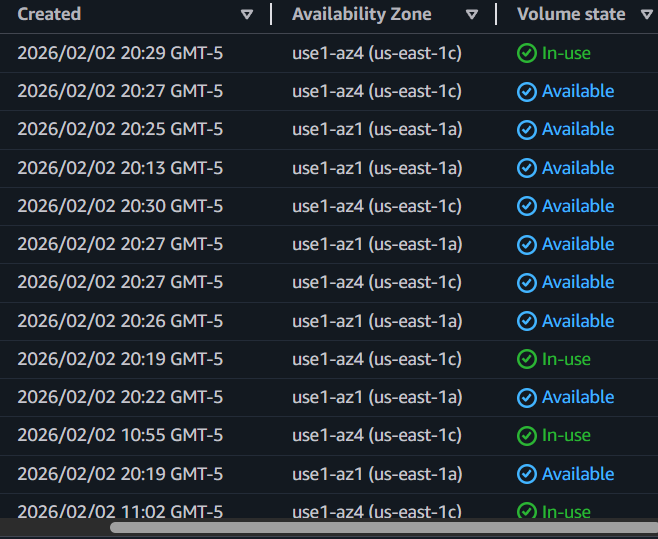
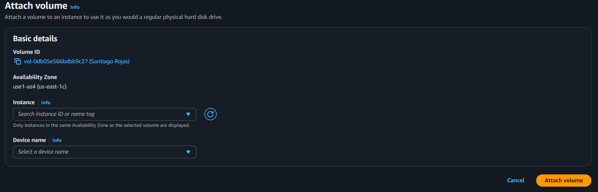
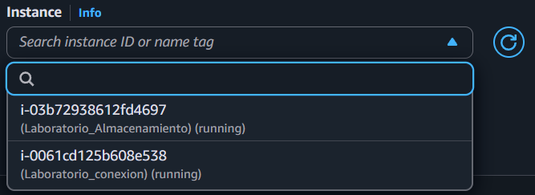
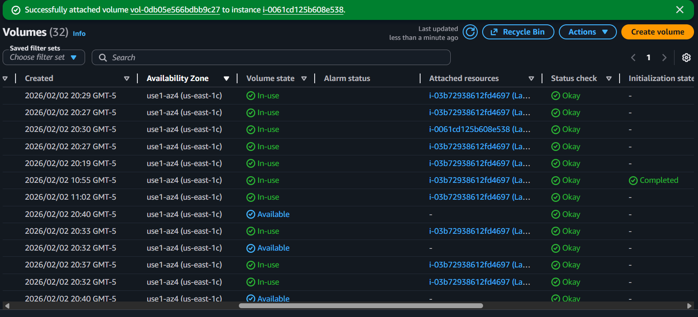
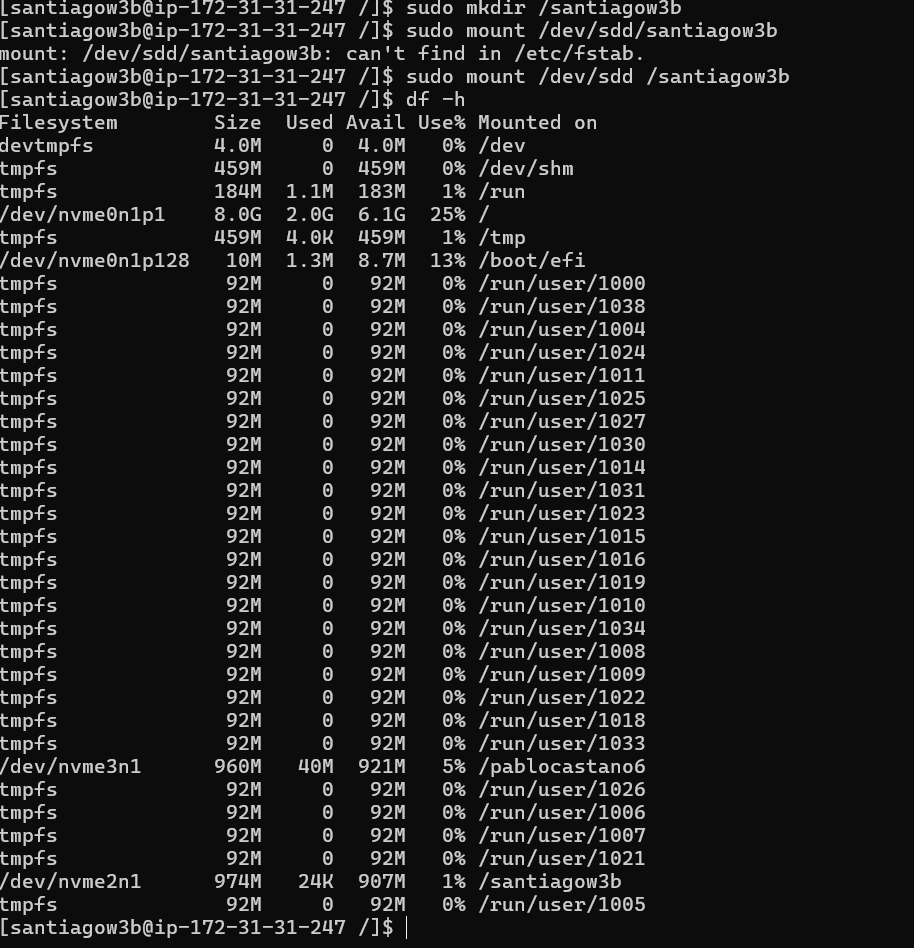
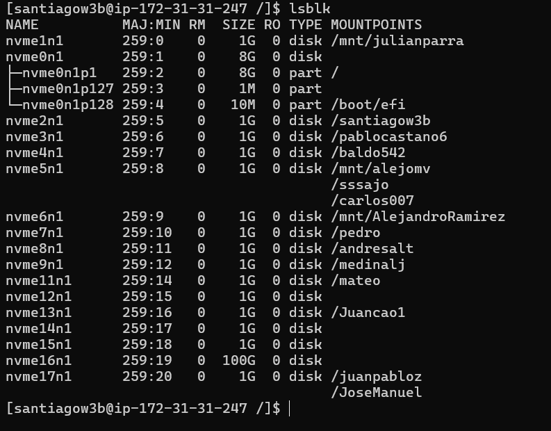
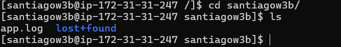

Me conecto mediante `ssh santiagow3b@35.175.199.96` 

`santiagow3b` es el user y `35.175.199.96` es la ip del server

y luego coloco la password




Creacion de volume



Que el volume este correctamente en la misma `Availability Zone` este en `use1-az4 (us-east-1c)`




Para cuando hagamos el `Attach volume`, atachemos el volume a una `instance` correctamente gracias a que estoy en la misma `Availability Zone`





Atachamos correctamente



Se monta el disco que se seleccion al atachar el volume con la instancia, mediante linux ssh con:

```bash
sudo mkdir /santiagow3b

sudo mount /dev/sdd/santiagow3b

df -h
```

y ahi ya aparecen todos los discos






Y doy todos los permisos con `sudo chmod 777 /santiagow3b` y creo un log de prueba


