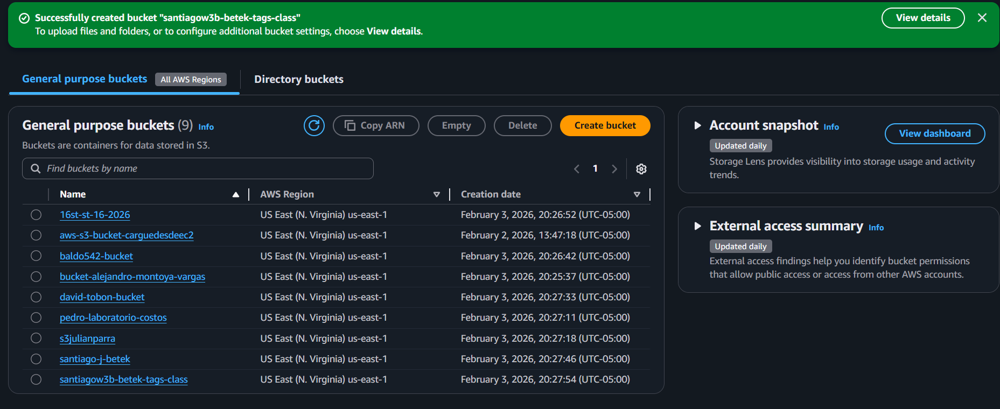
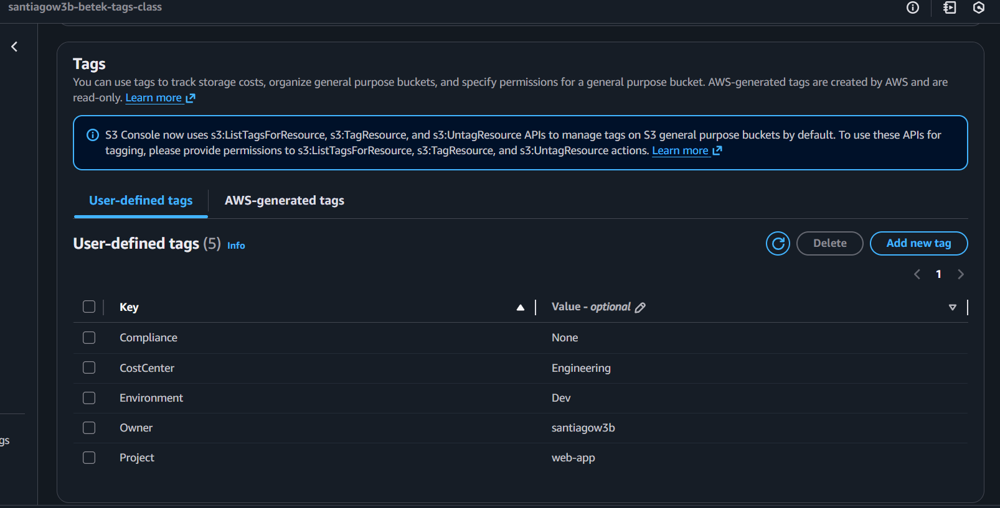
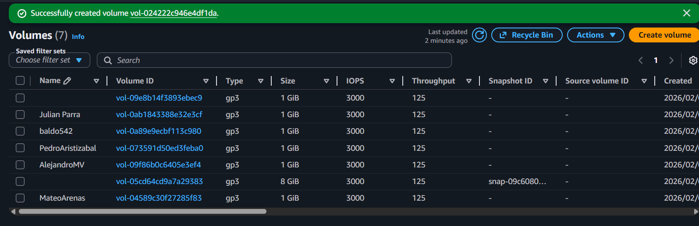
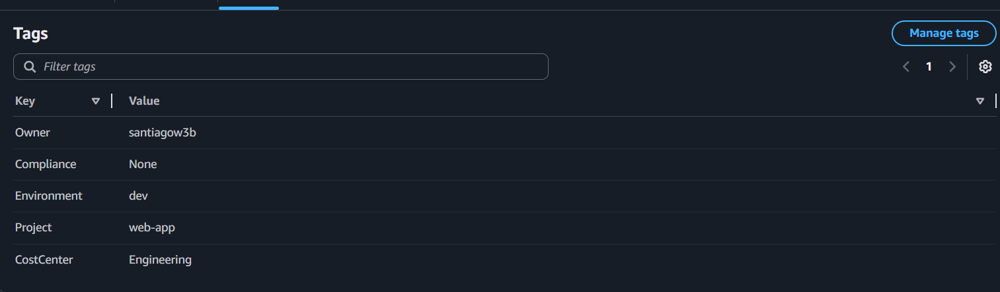

Cree el `bucket` con sus respectivos tags:

Cree una `volume` con sus respectivos tags:

Creacion de estimacion con `pricing calculator`:

PDF: [Pricing Calculator](../media/pricingCalculator.pdf)

Link: https://calculator.aws/#/estimate?id=7d5f55a68c34e505c02a2a36fc4082c2bf15b01e