Creando `VPC`:

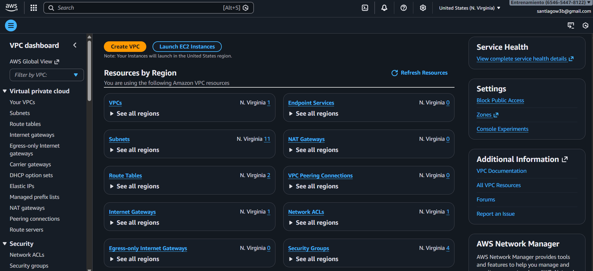

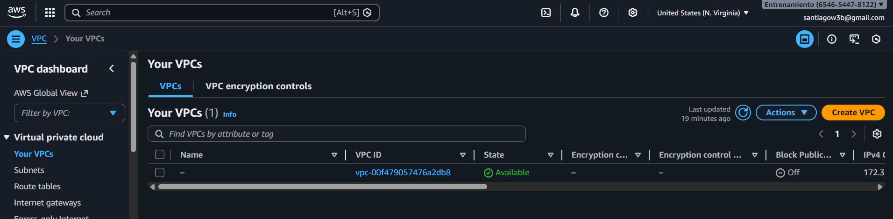

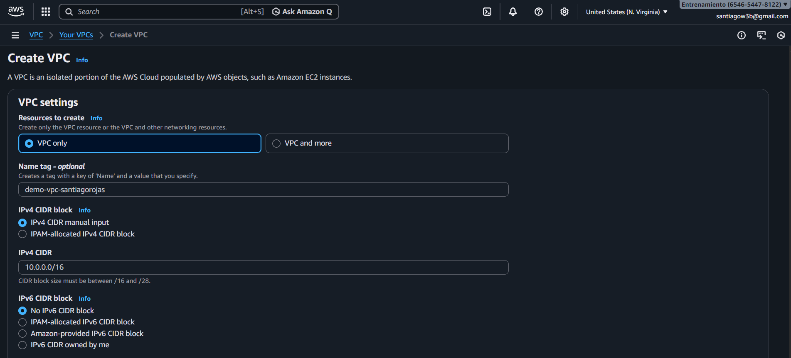

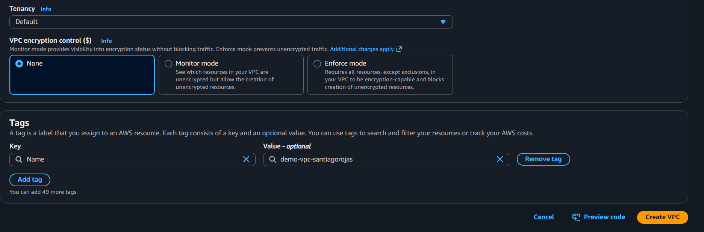

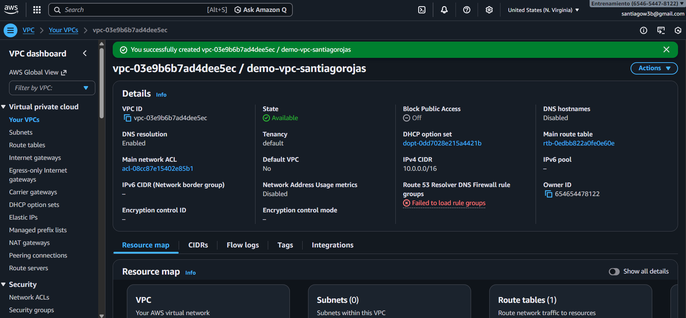

Creando `Subnet`:

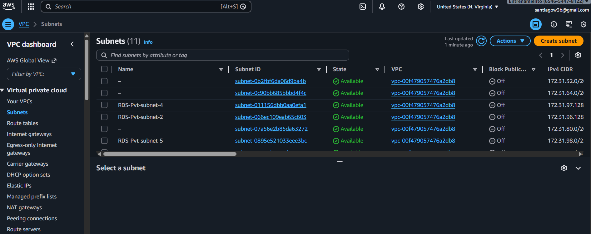

`Resource map`:

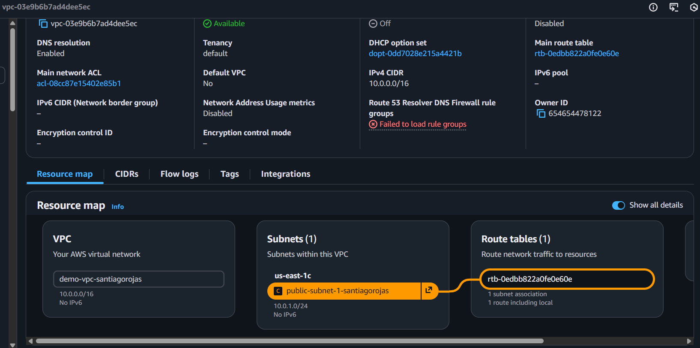

`Internet Gateway`:

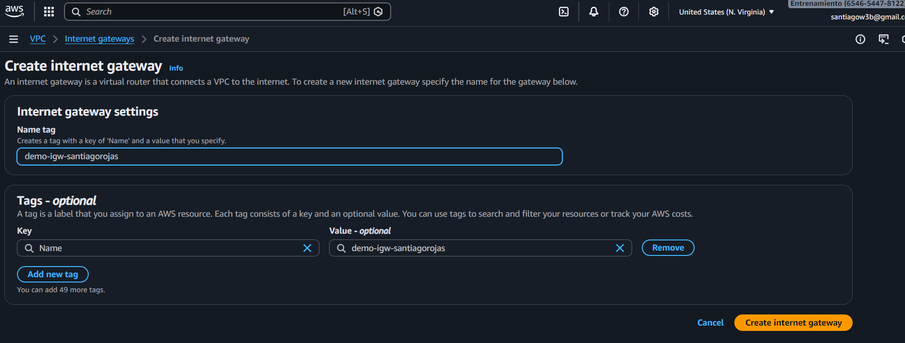

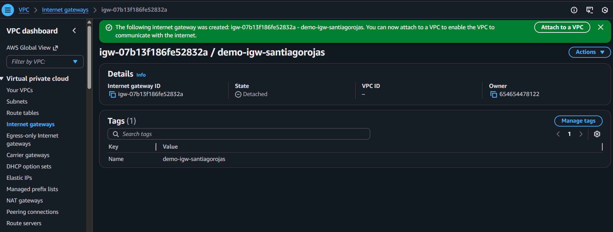

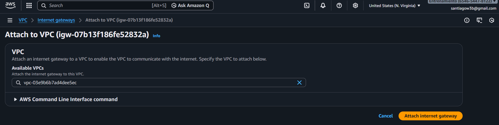

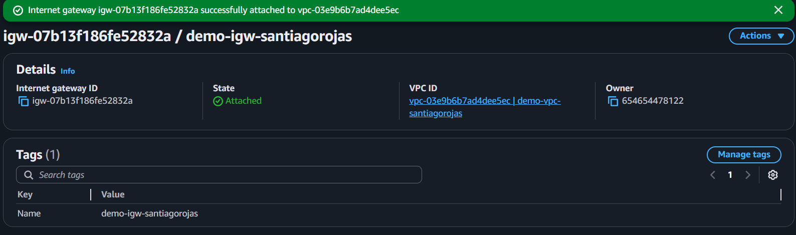

`Route Table`:

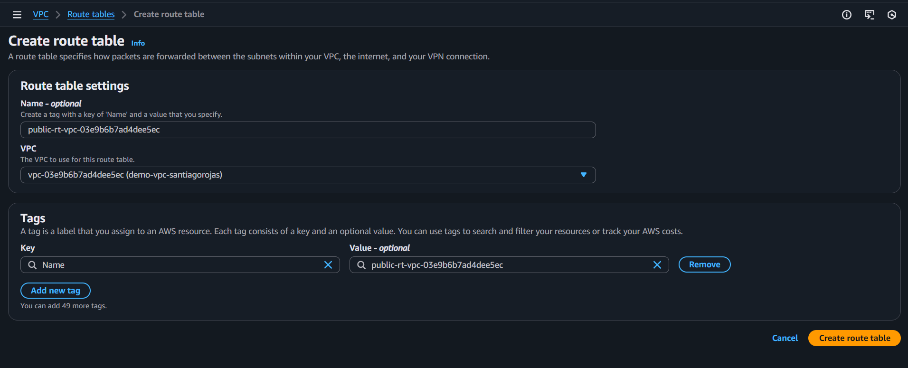

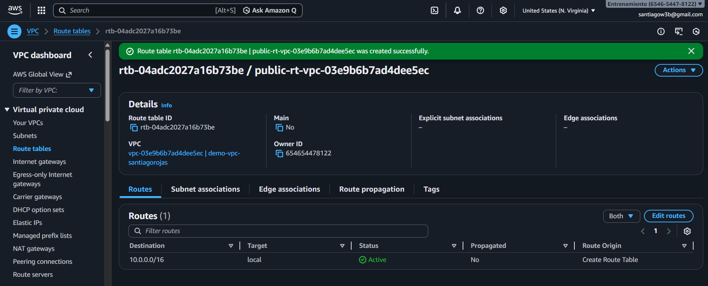

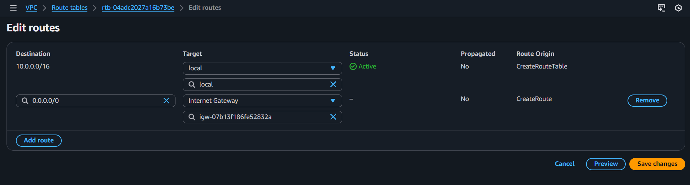

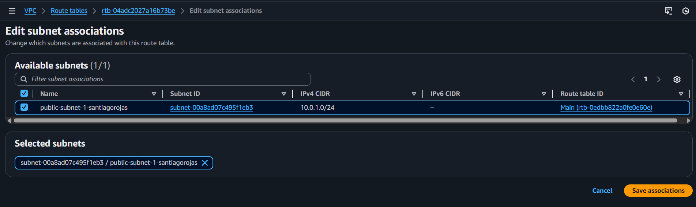

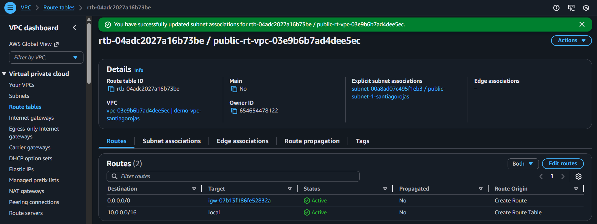

`Subnet Route Table`:

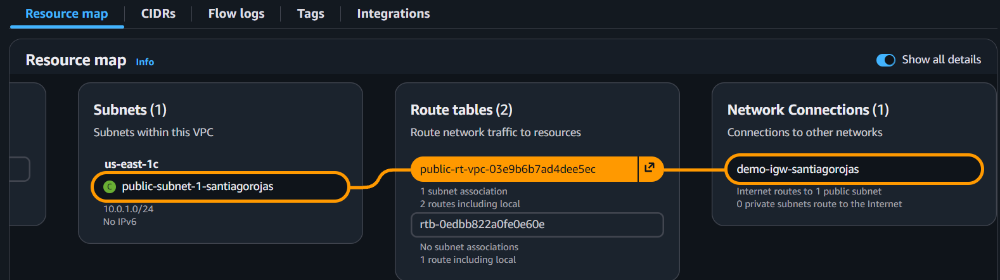

`Subnet Private`:

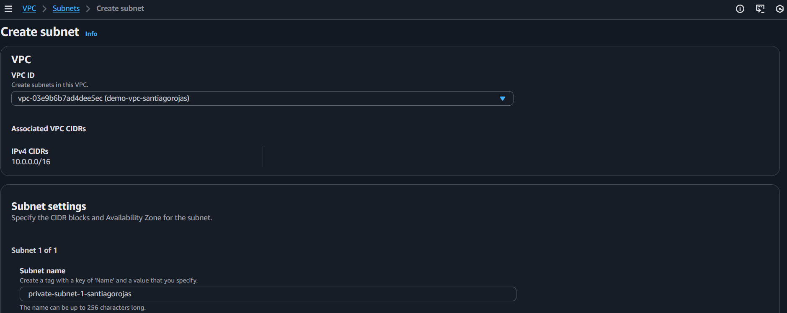

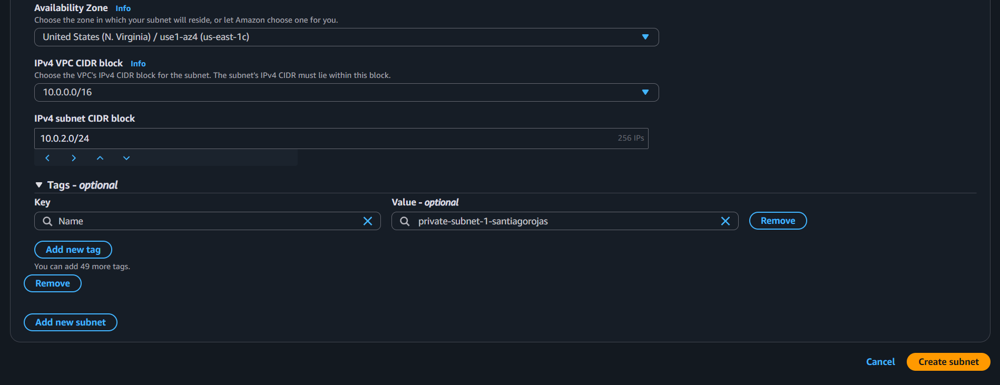

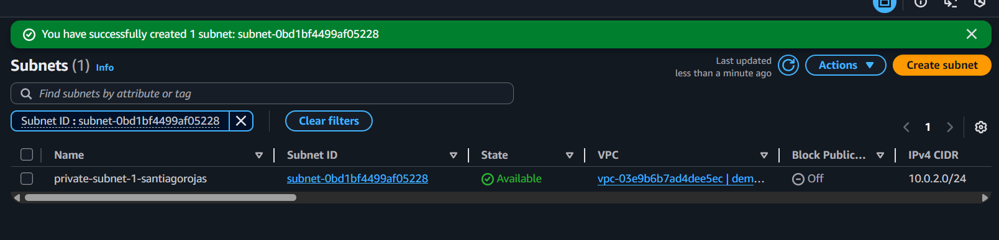

`Route Table Subnet Private`:

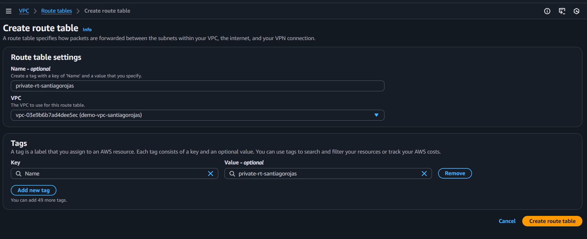

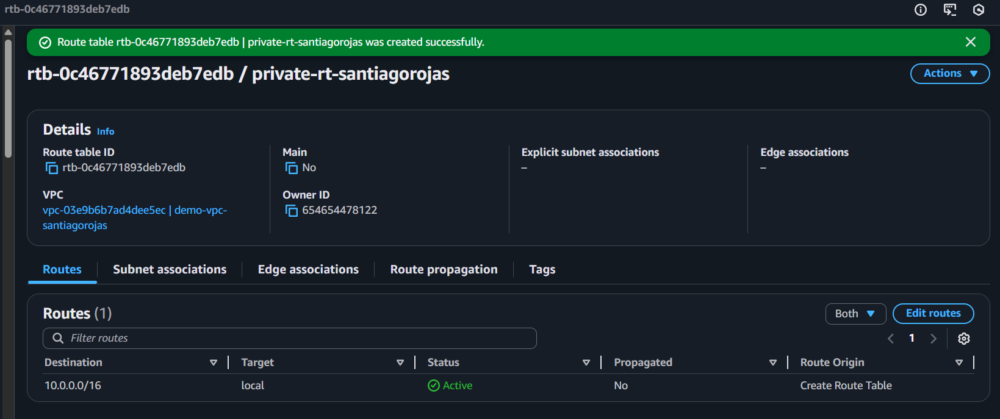

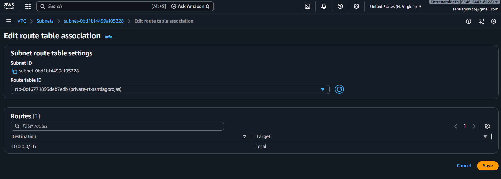

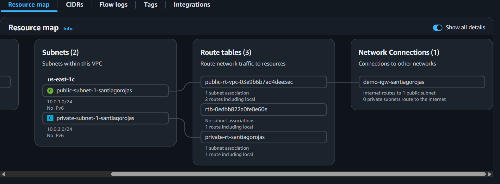

