## Key Pair

Key Pair creado:

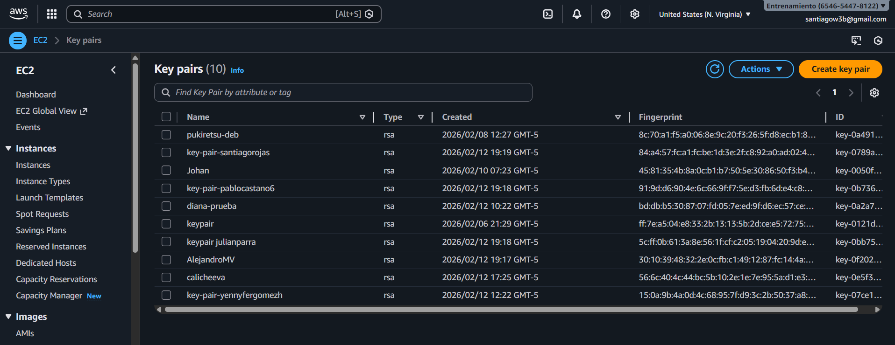

## EC2

Configuracion de la instace:

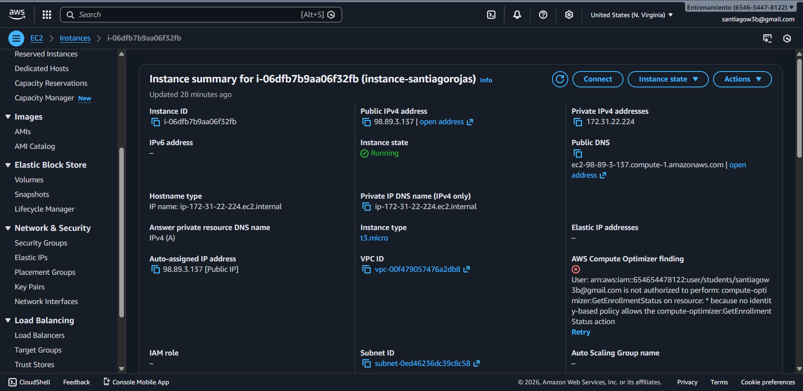

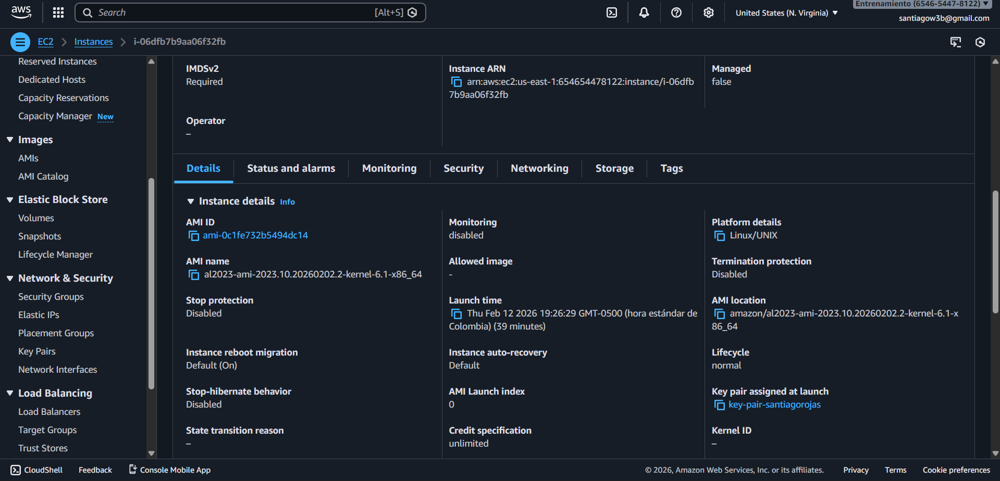

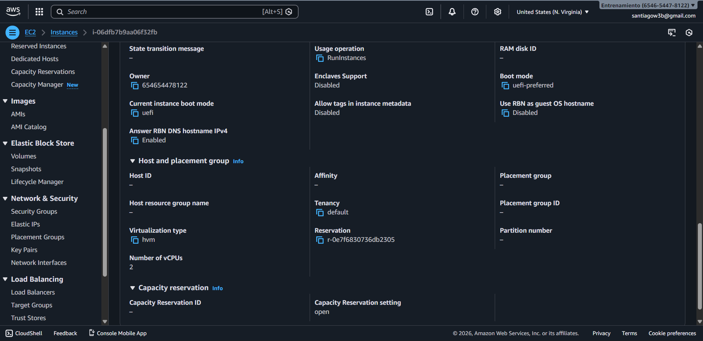

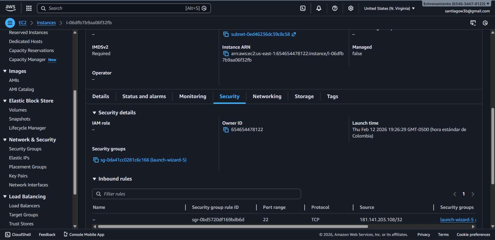

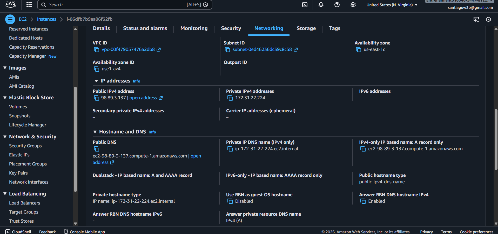

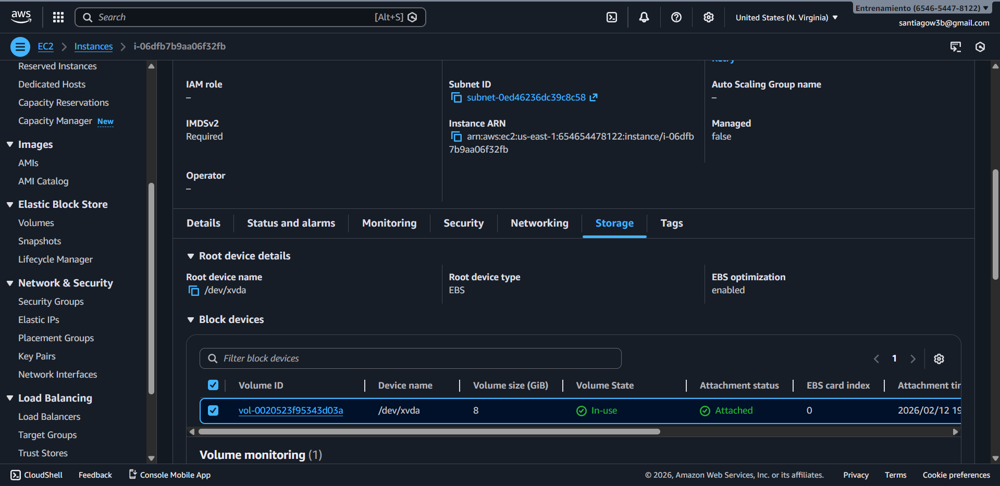

Instance creada:

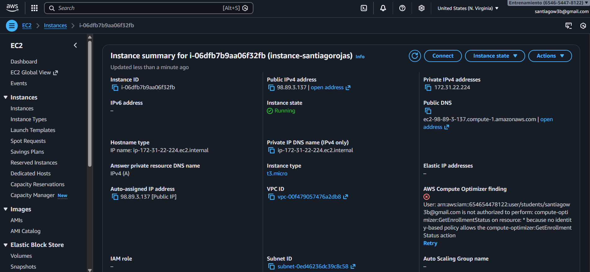

La pagina funciona:

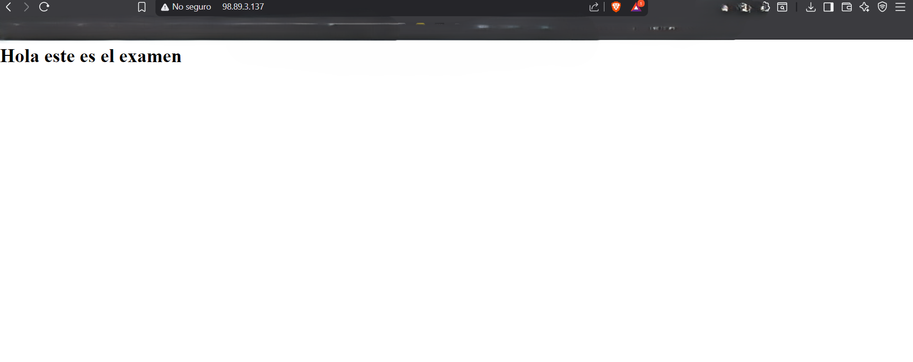

ssh funciona:

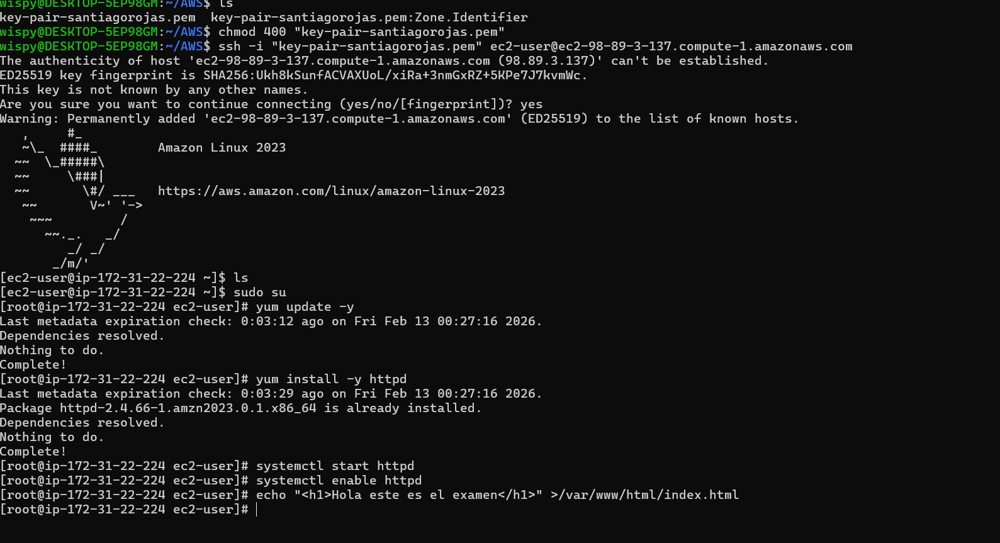

El userdata de la instance:

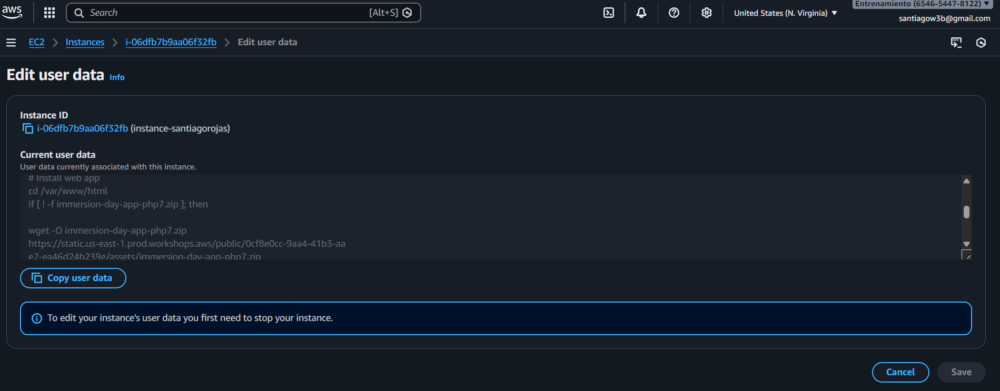

## EBS

Volume:

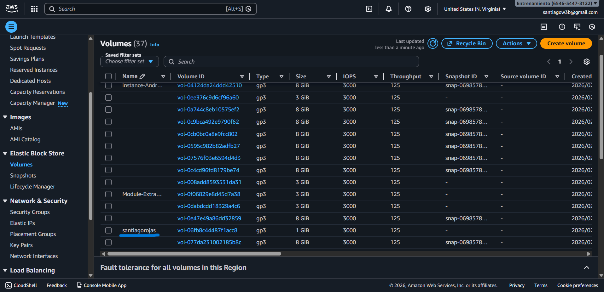

Volume atachado:

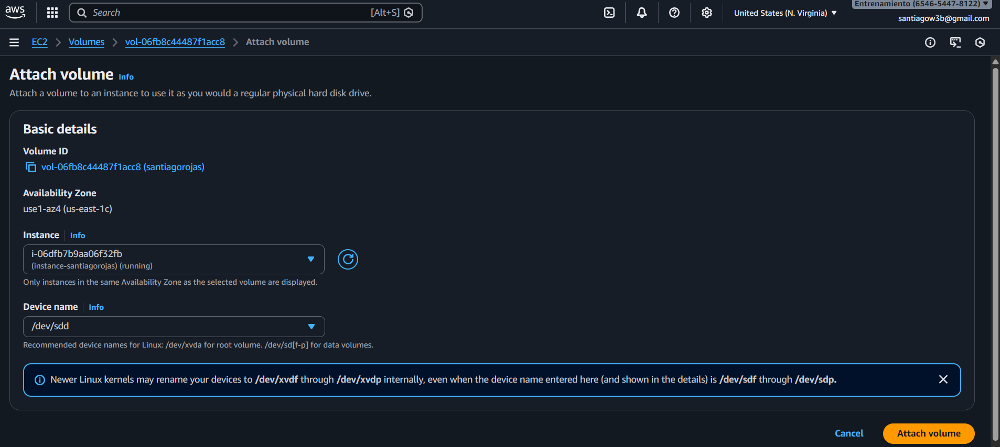

## S3

Bucket creado:

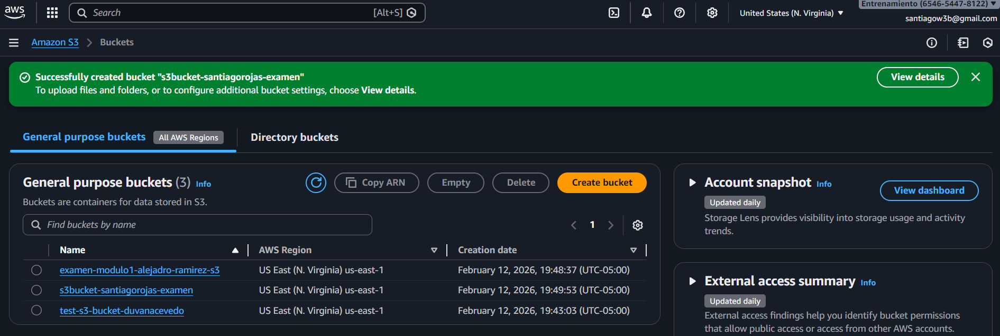

Archivo subido:

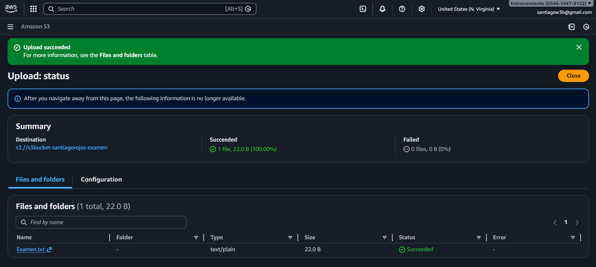